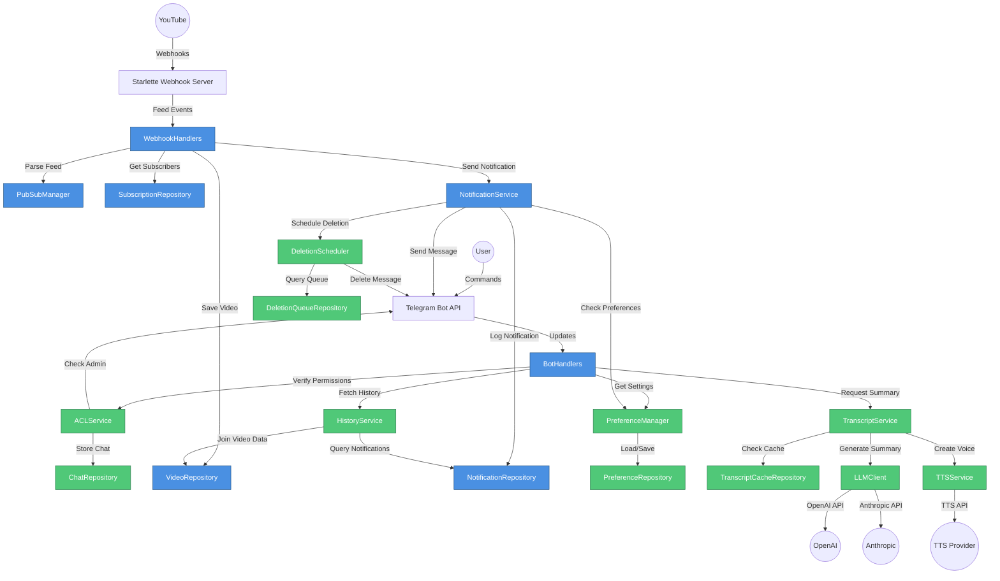

# 5. Component Architecture

## 5.1 New Components

### 5.1.1 ACLService

**Responsibility:** Verify user permissions for group/channel operations, implementing admin-only configuration controls (FR10, NFR14).

**Integration Points:**
- Called by BotHandlers before processing group/channel commands (`/subscribe`, `/unsubscribe` in group contexts)
- Uses Telegram Bot API getChatMember to verify user role
- Integrates with ChatRepository to retrieve/create chat records

**Key Interfaces:**
- `async verify_admin(user_id: str, chat_id: str) -> bool` - Check if user is admin/creator in chat
- `async get_user_permissions(user_id: str, chat_id: str) -> ChatPermissions` - Retrieve detailed permissions
- `async enforce_admin(update: Update) -> None` - Decorator-style enforcement (raises exception if not admin)

**Dependencies:**
- **Existing Components:** telegram.Bot (API calls), ChatRepository (chat data access)

**Technology Stack:** python-telegram-bot 22.5 (getChatMember API), async/await patterns

### 5.1.2 DeletionScheduler

**Responsibility:** Background job scheduler managing auto-deletion of notifications based on user/chat preferences (FR8).

**Integration Points:**
- Runs as background job via APScheduler or python-telegram-bot job_queue
- Queries DeletionQueue repository for pending deletions
- Calls telegram.Bot.delete_message() to remove expired notifications
- Updates DeletionQueue status after processing

**Key Interfaces:**
- `async schedule_deletion(notification_id: int, chat_id: str, message_id: str, delete_after_days: int) -> None` - Add deletion job
- `async process_pending_deletions() -> int` - Background job executor (returns count processed)
- `async cancel_deletion(notification_id: int) -> bool` - Cancel scheduled deletion

**Dependencies:**
- **Existing Components:** telegram.Bot (message deletion), NotificationRepository (notification data)
- **New Components:** DeletionQueueRepository, PreferenceManager (retrieve deletion settings)

**Technology Stack:** APScheduler 3.10+ (cron scheduling), async/await, retry logic for failed deletions

### 5.1.3 PreferenceManager

**Responsibility:** Centralized preference management for user/chat settings (auto-deletion timers, quiet hours, notification templates, premium feature flags).

**Integration Points:**
- Used by all handlers needing configuration (notification formatting, deletion scheduling, quiet hours checks)
- Abstracts PreferenceRepository with typed getters/setters
- Provides default values for missing preferences

**Key Interfaces:**
- `async get_preference(context: Union[User, Chat], key: str, default: Any = None) -> Any` - Retrieve preference with fallback
- `async set_preference(context: Union[User, Chat], key: str, value: Any) -> None` - Update preference
- `async get_auto_deletion_days(context: Union[User, Chat]) -> int | None` - Typed getter for deletion timer
- `async is_quiet_hours(context: Union[User, Chat]) -> bool` - Check if current time is in quiet hours

**Dependencies:**
- **Existing Components:** UserRepository, ChatRepository (context resolution)
- **New Components:** PreferenceRepository (data access)

**Technology Stack:** Pydantic for preference validation, JSON serialization for complex values

### 5.1.4 HistoryService

**Responsibility:** Manage update history with search, filtering, and pagination capabilities (FR9).

**Integration Points:**
- Queries NotificationRepository with complex filters (channel, date range, keyword)
- Formats results for Telegram message display with pagination buttons
- Integrates with BotHandlers for `/history` command

**Key Interfaces:**
- `async get_history(context: Union[User, Chat], filters: HistoryFilters, page: int = 1, page_size: int = 10) -> HistoryPage` - Retrieve filtered history
- `async search_history(context: Union[User, Chat], query: str) -> List[Notification]` - Full-text search
- `async export_history(context: Union[User, Chat], format: str = 'json') -> str` - Export history data

**Dependencies:**
- **Existing Components:** NotificationRepository, VideoRepository, ChannelRepository (joined queries)

**Technology Stack:** SQLAlchemy query filters, pagination helper utilities

### 5.1.5 LLMClient (Phase 3)

**Responsibility:** Abstract interface for multiple LLM providers (OpenAI, Anthropic) with retry logic, rate limiting, and error handling.

**Integration Points:**
- Used by TranscriptService for summary generation
- Implements fallback logic (try OpenAI, fallback to Anthropic if quota exceeded)
- Integrates with TranscriptCacheRepository for response caching

**Key Interfaces:**
- `async generate_summary(transcript: str, max_tokens: int = 500) -> SummaryResponse` - Generate video summary
- `async check_quota() -> QuotaStatus` - Verify API quota availability
- `async estimate_cost(transcript: str) -> float` - Estimate generation cost

**Dependencies:**
- **Existing Components:** httpx.AsyncClient (HTTP requests)
- **New Components:** TranscriptCacheRepository (cache lookup), PreferenceManager (premium feature access check)

**Technology Stack:** OpenAI Python SDK 1.12+, Anthropic SDK 0.18+, tenacity for retries

### 5.1.6 TranscriptService (Phase 3)

**Responsibility:** Orchestrate video transcript retrieval, LLM summarization, caching, and delivery (FR12).

**Integration Points:**
- Called by BotHandlers when user requests summary (inline button or `/summary` command)
- Retrieves video transcript via YouTube API or third-party transcript API
- Uses LLMClient for summarization with cache-first strategy
- Formats summary for Telegram message delivery

**Key Interfaces:**
- `async get_summary(video_id: str, language: str = 'en') -> str` - Retrieve or generate summary (cache-aware)
- `async generate_voice_narration(summary: str) -> bytes` - Convert summary to voice message (integrates with TTSService)
- `async invalidate_cache(video_id: str) -> None` - Force cache refresh

**Dependencies:**
- **Existing Components:** VideoRepository (video metadata), NotificationService (message sending)
- **New Components:** LLMClient, TranscriptCacheRepository, TTSService (optional)

**Technology Stack:** YouTube Transcript API (third-party library), async processing

### 5.1.7 TTSService (Phase 3)

**Responsibility:** Text-to-speech synthesis for voice message narration of summaries (FR13).

**Integration Points:**
- Called by TranscriptService for voice narration generation
- Supports multiple TTS providers (Google TTS, ElevenLabs, local Piper TTS)
- Caches generated audio to reduce generation costs

**Key Interfaces:**
- `async synthesize_speech(text: str, voice: str = 'default', language: str = 'en') -> bytes` - Generate audio from text
- `async list_available_voices() -> List[Voice]` - Retrieve voice options
- `async estimate_cost(text: str) -> float` - Estimate TTS generation cost

**Dependencies:**
- **Existing Components:** httpx.AsyncClient (API calls to TTS providers)
- **New Components:** PreferenceManager (voice preference settings), audio file caching storage

**Technology Stack:** Google TTS, ElevenLabs API, or Piper (local open-source TTS)

## 5.2 Component Interaction Diagram

## 5.3   Rationale & Key Decisions:

  Why Service Layer Introduction:

  Your current architecture has BotHandlers directly calling repositories and external APIs. I'm proposing a service layer (ACLService, PreferenceManager, HistoryService, etc.) to:

  1. Encapsulate Business Logic: Multi-step operations (verify admin → create chat → create subscription) are abstracted into service methods, keeping handlers thin
  2. Testability: Services can be mocked for handler unit tests without database dependencies
  3. Reusability: PreferenceManager.get_auto_deletion_days() used by both handlers and DeletionScheduler

  Trade-off: Adds abstraction layer (more files, more imports), but aligns with Domain-Driven Design principles and improves long-term maintainability.

  Component Responsibilities:

  - ACLService: Single Responsibility - authorization only. Does not create subscriptions or send notifications.
  - DeletionScheduler: Owns deletion lifecycle but delegates message deletion to Telegram API wrapper
  - PreferenceManager: Abstracts repository layer with typed interfaces, providing schema flexibility (can change preference storage without affecting consumers)
  - LLMClient: Provider abstraction enables multi-vendor support and cost optimization (fallback logic)

  Integration Pattern:

  The new components I'm proposing follow the existing architectural patterns I identified in your codebase:

  1. Repository Pattern: All new repositories (ChatRepository, PreferenceRepository, etc.) follow your existing ChannelRepository structure with async methods and session management
  2. Async/Await Consistency: All service methods are async to integrate with your existing async bot handlers and webhook processing
  3. Dependency Injection: Services receive dependencies (repositories, API clients) via constructor, matching your BotHandlers.__init__(youtube_api) pattern

  Does this match your project's reality?

  Areas Needing Validation:

  - Service Layer Depth: Should services be thin facades over repositories, or contain substantial business logic? (e.g., Should ACLService cache admin status to reduce API calls?)
  - Background Job Framework: Confirm APScheduler preference vs. sticking with python-telegram-bot job_queue for simpler deployment
  - LLM Fallback Logic: Should fallback be automatic (try OpenAI → Anthropic), or user-configurable preference?

---
